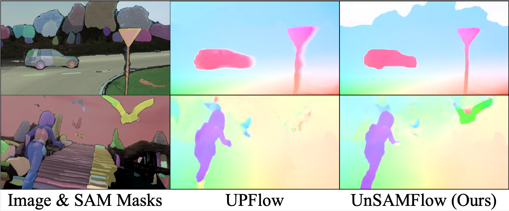

# UnSAMFlow: Unsupervised Optical Flow Guided by Segment Anything Model (CVPR 2024)

  

This repository contains the PyTorch implementation of our paper titled *UnSAMFlow: Unsupervised Optical Flow Guided by Segment Anything Model*, accepted by CVPR 2024.

__Authors__: Shuai Yuan, Lei Luo, Zhuo Hui, Can Pu, Xiaoyu Xiang, Rakesh Ranjan, Denis Demandolx.



## Disclaimer
Our code is developed on our internal AI platform and has not been tested on regular linux systems. Some of the code depends on internal tools and packages that we cannot share here, but we will talk about ways to work around.

- We use our own internal correlation module, which is not included in this repo. Alternatively, we provide two optional correlation modules in the code to work around:

    1. A correlation package (included in [models/correlation_package](./models/correlation_package/)) that you may need to install. Instructions can be found [here](https://github.com/duke-vision/semantic-unsup-flow-release#environment). After you install the package, uncomment [models/pwclite.py, Line 6](./models/pwclite.py#L6) and [Line 207-215](./models/pwclite.py#L207) to enable that.
    2. A naive correlation implementation in pytorch. This naive implementation could be very slow and should only be used if none of the former methods work. Simply uncomment [models/pwclite.py, Line 7](./models/pwclite.py#L7) and [Line 207-215](./models/pwclite.py#L207) to enable it.

- We use our own file systems for all I/O operations. You may need to redefine your own directories and input/output stream by adjusting the code based on your own file system.

## Datasets

Due to copyright issues, please download the dataset from the official websites.

- **Sintel**: [Sintel clean+final](http://sintel.is.tue.mpg.de/downloads); [Sintel raw](https://github.com/lliuz/ARFlow#datasets-in-the-paper) (prepared by ARFlow authors; please follow instructions on this page to download).

- **KITTI**: [KITTI 2015](http://www.cvlibs.net/download.php?file=data_scene_flow_multiview.zip); [KITTI 2012](http://www.cvlibs.net/download.php?file=data_stereo_flow_multiview.zip); [KITTI raw](http://www.cvlibs.net/datasets/kitti/raw_data.php).


## Segment Anything Model
Please follow the [official repo](https://github.com/facebookresearch/segment-anything) to infer SAM masks for all samples. We use the default ViT-H SAM model. The code for generating full segmentation and finding key objects from SAM masks is also included in [sam_inference.py](./sam_inference.py).


## Usage

We provide scripts and code to run each of our experiments. Before running the experiments, please redefine the input/output directories in the scripts. For each row in our final result tables (Tabs. 1-2 in the paper), please run the following to reproduce those results.

**Ours (baseline)**:

```shell
# KITTI
python3 train.py -c configs/kitti_base.json --n_gpu=N_GPU --exp_folder=EXP_FOLDER

# Sintel
python3 train.py -c configs/sintel_base.json --n_gpu=N_GPU --exp_folder=EXP_FOLDER
```

**Ours (+aug)**:

```shell
# KITTI
python3 train.py -c configs/kitti_aug.json --n_gpu=N_GPU --exp_folder=EXP_FOLDER

# Sintel
python3 train.py -c configs/sintel_aug.json --n_gpu=N_GPU --exp_folder=EXP_FOLDER
```

**Ours (+aug +hg)**:

```shell
# KITTI
python3 train.py -c configs/kitti_aug+hg.json --n_gpu=N_GPU --exp_folder=EXP_FOLDER

# Sintel
python3 train.py -c configs/sintel_aug+hg.json --n_gpu=N_GPU --exp_folder=EXP_FOLDER
```

**Ours (+aug +hg +mf)**:

```shell
# KITTI
python3 train.py -c configs/kitti_aug+hg+mf.json --n_gpu=N_GPU --exp_folder=EXP_FOLDER

# Sintel
python3 train.py -c configs/sintel_aug+hg+mf.json --n_gpu=N_GPU --exp_folder=EXP_FOLDER
```

## Code credits
The overall structure of this code is adapted from the official [SemARFlow github repo](https://github.com/duke-vision/semantic-unsup-flow-release), appeared in their publication [SemARFlow: Injecting Semantics into Unsupervised Optical Flow Estimation for Autonomous Driving](https://openaccess.thecvf.com/content/ICCV2023/papers/Yuan_SemARFlow_Injecting_Semantics_into_Unsupervised_Optical_Flow_Estimation_for_Autonomous_ICCV_2023_paper.pdf).

## License

The majority of UnSAMFlow is licensed under CC-BY-NC, however portions of the project are available under separate license terms: SemARFlow and ARFlow are licensed under the MIT license.

Copyright (c) Meta Platforms, Inc. and affiliates.
